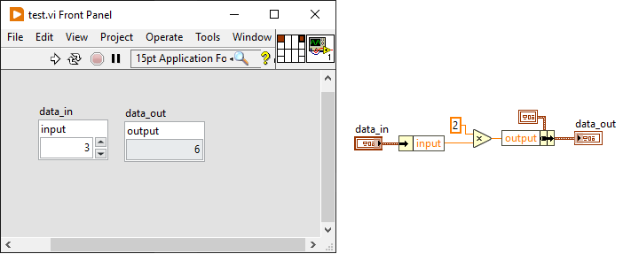
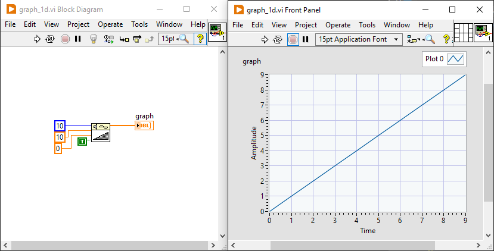
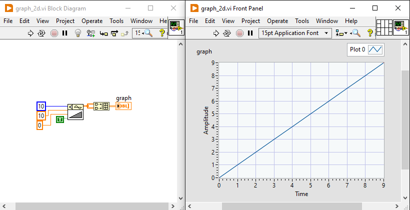
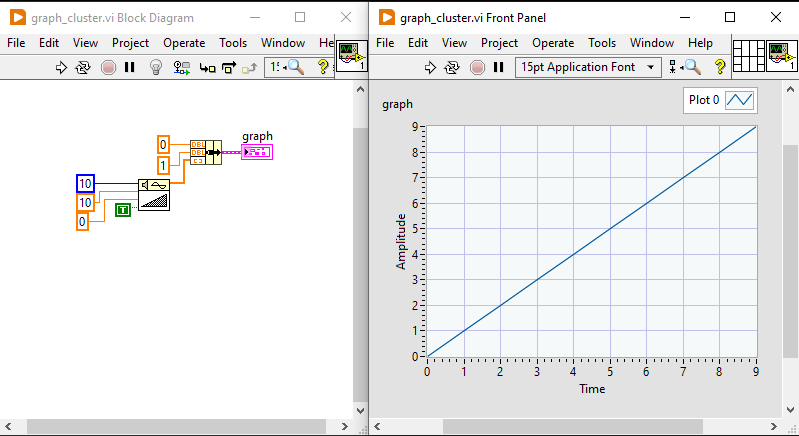
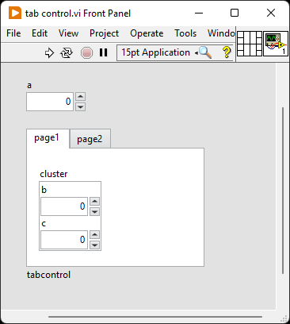
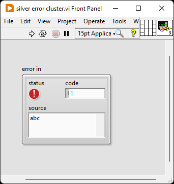

# autolv - Interact with LabVIEW VIs from Python

The only export from autolv is App that opens an ActiveX connection to
LabVIEW through its VI Server. With a reference to LabVIEW it is then possible
to open an ActiveX connection to a specific VI. The primary use case for this
library is to set control values on the VI front panel from Python, run the VI,
and read the control values back into Python.

Installation
------------
pip install autolv

Example usage
-------------
Suppose the VI name is 'test.vi' and has a single Numeric control with the name (label)
'input' and a single Numeric indicator with the name 'output'. The VI implements
2*'input' -> 'output'

```python
>>> import autolv
>>> lv = autolv.App()
>>> vi = lv.open('test.vi')
>>> vi.input = 2.0
>>> vi.run()
>>> vi.output
4.0
```

Now move the 'input and 'output' Numeric controls into a Cluster called 'data'.


```python
>>> vi = lv.open('test.vi')
>>> vi.data.input = 3.0
>>> vi.run()
>>> vi.data.output
6.0
```

It's possible to get an error code explanation. Suppose a VI attempts to create
an invalid DAQmx channel.


```python
>>> vi = lv.open('error.vi')
>>> vi.DAQmx = "PXI1Slot2"
>>> vi.run()
>>> vi['error out'].code.value
-201237
>>> lv.explain_error(_)
'Physical channel name specified is invalid...'
```

In Jupyter, run the VI in the following way:

```python
In [1]: import autolv
In [2]: lv = autolv.App()
In [3]: vi = lv.open('test.vt')
In [4]: vi.input = 2.0
In [5]: await vi.run()
In [6]: vi.output
Out[6]: 4.0
```

As a context manager:

```python
>>> with autolv.App() as lv:
    vi = lv.open(<file>)
    ...
>>>
```

LabVIEW will close upon exiting the context if it was not running prior to
entering the context.

VI() and VI.run()
-----------------

It is possible to call the VI object directly instead of using VI.run(). Reusing the
'test.vi' from above where `output`= 2 * `input` and these controls have been wired
to the connector pane:

```python
>>> import autolv
>>> lv = autolv.App()
>>> vi = lv.open('test.vi')
>>> vi(input=2.0, output=0.0)
>>> vi.output
4.0
```

There are two key differences between VI() and VI.run():
- VI() is blocking where as VI.run() is an asyncio task and supports a timeout.
- VI() supports reentrant calls where as VI.run() is equivalent to Operate->Run and
    does not support reentrant calls.

Specify a cluster as a dictionary. Suppose 'test.vi' has a cluster `data_in` with
one numeric control `input` and a cluster `data_out` with one numeric indicator `output`
and `output` = 2 * `input`:



```python
>>> vi = lv.open('test.vi')
>>> vi(data_in={"input": 3}, data_out={})
>>> vi.data.output
6.0
```

Control labels
--------------
It is recommended to label controls as a valid Python identifier which improves
productivity when using dot-access in an interactive session. But, LabVIEW controls
often are given names that are invalid Python identifiers. It is possible to work
with these. Suppose a numeric control is labeled `x in` and the indicator `y out`:

```python
>>> import autolv
>>> lv = autolv.App()
>>> vi = lv.open('test.vi')
>>> vi(**{"x in": 3, "y out": 0})
>>> vi["y out"]
4.0
```

Waveform Graph
--------------
The Waveform Graph control can be a 1d array of y-axis values, 2d array of x-axis and
y-axis values, or a cluster (t0, dt, Y) where t0 and dt are scalers and Y is the
y-axis values.

## As 1d array



```python
>>> vi = lv.open("graph_1d.vi")
>>> vi.run()
>>> vi.graph.value
array([0., 1., 2., 3., 4., 5., 6., 7., 8., 9.])
```

## As 2d array



```python
>>> vi = lv.open("graph_1d.vi")
>>> vi.run()
>>> vi.graph.value
array([[0., 1., 2., 3., 4., 5., 6., 7., 8., 9.],
       [0., 1., 2., 3., 4., 5., 6., 7., 8., 9.]])
```

## As cluster



```python
>>> vi = lv.open("graph_cluster.vi")
>>> vi.run()
>>> vi.graph.value
[0.0, 1.0, (0.0, 1.0, 2.0, 3.0, 4.0, 5.0, 6.0, 7.0, 8.0, 9.0)]
>>> vi.graph.t0
0.0
>>> vi.graph.dt
1.0
>>> vi.graph.Y
array([0., 1., 2., 3., 4., 5., 6., 7., 8., 9.])
```

## Tab control



```python
>>> vi = lv.open("tab control.vi")
>>> vi.tabcontrol.page1.cluster.b
0.0
```

## Project

```python
>>> project = lv.open('<file>.lvproj')
>>> vi = project.open('<file>.vi')
```

## Reordering cluster controls
Clusters in the Silver visual style need to be reordered after opening the VI.



```python
>>> vi = lv.open("silver error cluster.vi")
>>> vi["error in"]
Cluster({'code': True, 'source': , 'status': False})
>>> cluster = vi["error in"]
>>> cluster.reorder_controls(["status", "code", "source"])
>>> vi.read_controls()
>>> vi["error in"]
Cluster({'status': True, 'code': 1, 'source': abc})
```

Notes
-----
- LV Controls have a Label attribute. ActiveX calls this Label 'name' and this is
the only mechanism for set/get a Control. So, the Label must be unique among
the front panel controls.
- As a best practice, it is recommended to set the Label to a valid Python identifier.
This increases productivity when using dot-access in an interactive session such as
IPython.
- If your machine has multiple LabVIEW versions, launch the desired version first
before interacting with it in Python.
- LV's 'Time Stamp' comes across ActiveX as naive and represented in Python
as datetime.datetime.
- LabVIEW's FXP and Waveform data types are not supported
- Array's of clusters can be read but not set
