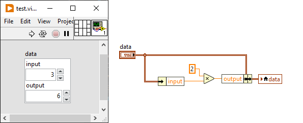
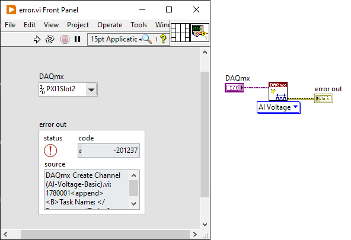

# autolv - Interact with LabVIEW VIs from Python

The only export from autolv is App that opens an ActiveX connection to
LabVIEW through its VI Server. With a reference to LabVIEW it is then possible
to open an ActiveX connection to a specific VI. The primary use case for this
library is to set control values on the VI front panel from Python, run the VI,
and read the control values back into Python.

Installation
------------
pip install autolv

Example usage
-------------
Suppose the VI name is 'test.vi' and has a single Numeric control with the name (label)
'input' and a single Numeric indicator with the name 'output'. The VI implements
2*'input' -> 'output'

```python
>>> import autolv
>>> lv = autolv.App()
>>> vi = lv.get_VI('test.vi')
>>> vi.input = 2.0
>>> vi.run()
>>> vi.output
4.0
```

Now move the 'input and 'output' Numeric controls into a Cluster called 'data'.



```python
>>> vi = lv.get_VI('test.vi')
>>> vi.data.input = 3.0
>>> vi.run()
>>> vi.data.output
6.0
```

It's possible to get an error code explanation. Suppose a VI attempts to create
an invalid DAQmx channel.



```python
>>> vi = lv.get_VI('error.vi')
>>> vi.DAQmx = "PXI1Slot2"
>>> vi.run()
>>> vi['error out'].code.value
-201237
>>> lv.explain_error(_)
'Physical channel name specified is invalid...'
```

In Jupyter, run the VI in the following way:

```python
In [1]: import autolv
In [2]: lv = autolv.App()
In [3]: vi = lv.get_VI('test.vt')
In [4]: vi.input = 2.0
In [5]: await vi.run()
In [6]: vi.output
Out[6]: 4.0
```

As a context manager:

```python
>>> with autolv.App() as lv:
    vi = lv.get_VI(<file>)
    ...
>>>
```

Upon exiting the context, LabVIEW will be closed.

Notes
-----
- LabVIEW's Cluster is supported, but not as nested clusters.
- LV Controls have a Label attribute. ActiveX calls this Label 'name' and this is
the only mechanism for set/get a Control. So, the Label must be unique among
the front panel controls.
- As a best practice, it is recommended to set the Label to a valid Python identifier.
This increases productivity when using dot-access in an interactive session such as
IPython.
- If your machine has multiple LabVIEW versions, launch the desired version first
before interacting with it in Python.
- LV's 'Time Stamp' comes across ActiveX as naive and represented in Python
as datetime.datetime.
